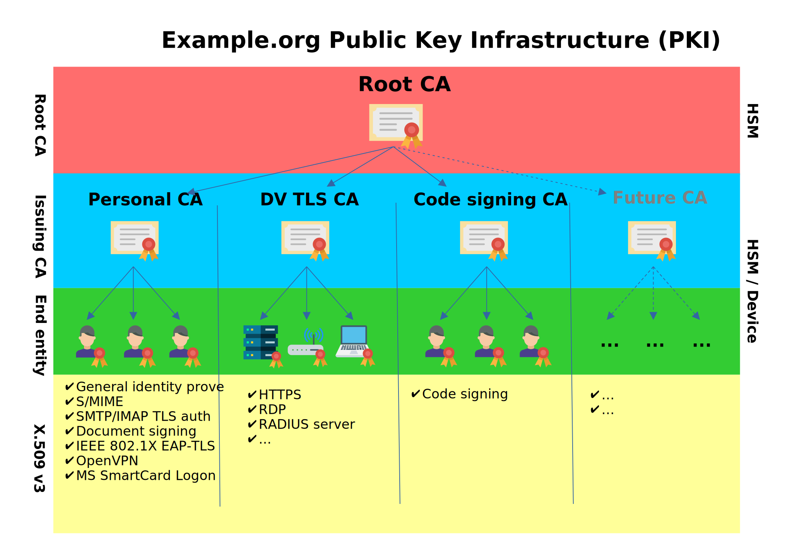

# A Complete OpenSSL Certificate Authority
## Abstract
This manual explains how to [create](man/init-root.md) and [use](man/issue-personal.md) a real-world use-case Certificate Authority in small/medium-sized organizations using the OpenSSL toolkit.  
Great emphasis is placed on [X.509v3 attributes](#supported-end-entity-certificate-types) to enable multipurpose use of end-entity certificates.  
To demonstrate the seriousness of the Certificate Authority to our partners, we will restrict the CA using `nameConstraints` and store CA private keys in [FIPS-certified HSM](man/init-token.md), which will be used for end-entity certificate signing.  
CA private keys will be [backed on a USB drive, asymmetrically encrypted](man/backup.md), and stored in a safe place.
The manual consists of `openssl.cnf` configuration file and multiple OpenSSL binary calls.  
Calling OpenSSL manually is straightforward and comprehensible but not the most effective and human error-proof solution though.  
The next step would be to create a wrapper similar to [EasyRSA](https://github.com/OpenVPN/easy-rsa) shell or [FreeRADIUS Makefile](https://github.com/FreeRADIUS/freeradius-server/blob/master/raddb/certs/Makefile) wrapper, that will automate the process and include automated checks.

## Contents
### CA Initialization
- [OID request](man/oid.md)
- [Safenet eToken 5300 environment setup & token initialization](man/init-token.md)
- [CA configuration, nameConstraints, directory initialization](man/init.md)
- [Root Certificate Authority initialization](man/init-root.md)
- [DV TLS Certificate Authority initialization](man/init-dvtls.md)
- [Personal Certificate Authority initialization](man/init-personal.md)
- [Private key backup usage](man/backup.md)

### Issuing & revoking certificates, CRL, OCSP
- [RADIUS server certificate issue](man/issue-radius.md)
- [Personal certificate issue](man/issue-personal.md)
- [DV TLS certificate issue](man/issue-dvtls.md)
- [CRL issue](man/issue-crl.md)
- [OCSP certificate issue](man/issue-ocsp.md)
- [Revoking a certificate](man/revoke.md)

## HSM keypair IDs
- 1 = Root CA
- 2 = DV TLS CA
- 3 = Personal CA

## Supported End-entity Certificate Types
| **Certificate type**      | **Openssl `-extensions` name** | **Purposes**                                                                                                                      |
|---------------------------|------------------------------|-----------------------------------------------------------------------------------------------------------------------------------|
| Personal certificate      | `v3_personal` | S/MIME, MS document signing, MS smart card / certificate logon, SMTP/IMAP certificate authentication, 802.1X EAP-TLS, IPSec IKE authentication, OpenVPN authentication |
| Server certificate        | `v3_server` | SSL/TLS, HTTPS, RDP |
| RADIUS server certificate | `v3_radius_server` | RADIUS server |
| OCSP                      | `v3_ocsp` | OCSP signing |

## Author
[Matyáš Vohralík](https://mv.cesium.cz), 2022-23

## License
[BSD 3-Clause](LICENSE)

## References
- CA/Browser Forum, ”Baseline Requirements for the Issuance and
Management of Publicly‐Trusted Certificates”. Available at: [https://cabforum.org/wp-content/uploads/CA-Browser-Forum-BR-v2.0.1.pdf](https://cabforum.org/wp-content/uploads/CA-Browser-Forum-BR-v2.0.1.pdf) (accessed November 7, 2023).
- The OpenSSL Project Authors, ”x509v3_config”. Available at: [https://www.openssl.org/docs/manmaster/man5/x509v3_config.html](https://www.openssl.org/docs/manmaster/man5/x509v3_config.html) (accessed May 10, 2023). 
- GÉANT Association, ”Eap server certificate considerations”. Available at: [https://wiki.geant.org/display/H2eduroam/EAP+Server+Certificate+considerations](https://wiki.geant.org/display/H2eduroam/EAP+Server+Certificate+considerations) (accessed May 10, 2023). 
- Microsoft Corporation, ”Certificate requirements and enumeration - windows security”. Available at: [https://learn.microsoft.com/en-us/windows/security/identity-protection/smart-cards/smart-card-certificate-requirements-and-enumeration](https://learn.microsoft.com/en-us/windows/security/identity-protection/smart-cards/smart-card-certificate-requirements-and-enumeration) (accessed May 10, 2023). 
- Nguyen, J., ”OpenSSL certificate authority”. Available at: [https://jamielinux.com/docs/openssl-certificate-authority/](https://jamielinux.com/docs/openssl-certificate-authority/) (accessed May 10, 2023).
